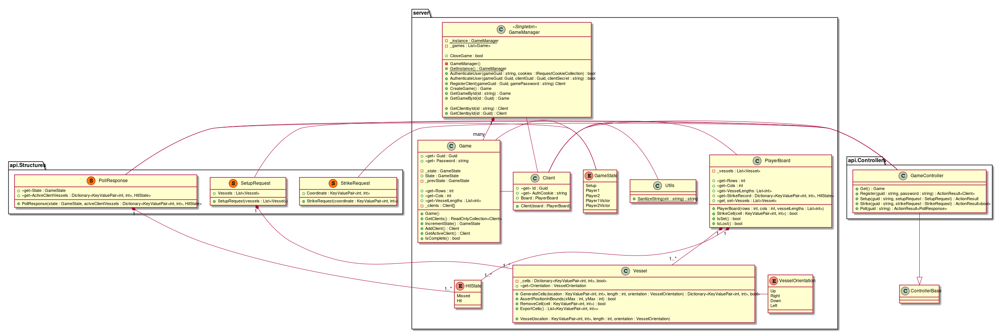

## Battleship Online: Server
##### What is this project?
This is a C# final project made for CSC-260 (Object Oriented Design). The goal of this project is to make a multiplayer
version of the classic Battleship game, that allows users to play together online and in real time.

##### How is this accomplished?
The Battleship Online project is split into two parts: the server, and a client. The server (this project)
exposes an HTTP(S) API that any client can connect to. The server manages all running games and is made
with distrust in mind: 'hacked' clients are to be expected, so all input must be validated.
Using HTTP(S) requests to communicate with the server opens the door for clients to be built on almost
any device that can browse the internet. One could even build a JavaScript client on a webpage.
The options are endless.  

The current, example, Windows client was built by a friend for his own CSC-260 final. It connects to this
server over the internet and provides users with an interface to interact with the game. You can
find his code [here](https://github.com/wes1095/Battleship).

##### How do I use this project?
Instructions for running this server are beyond the scope of this readme. Here are details about
my development environment: Arch Linux using .NET Core v2.2, developed in JetBrains Rider.

##### Why is your code so messy?
What ever do you mean?
